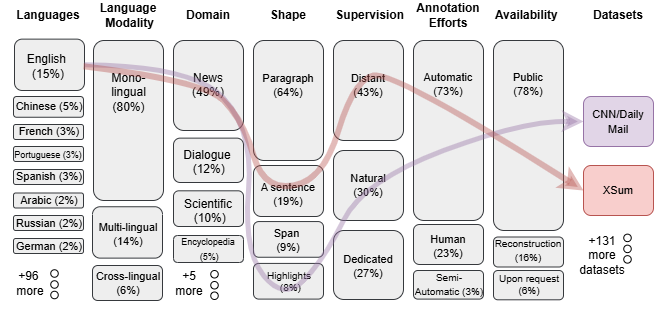
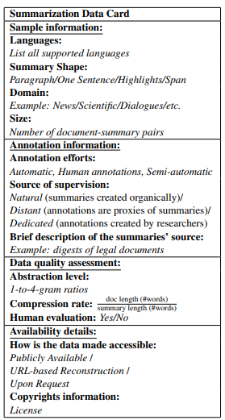

# Awesome-Summarization-Datasets
The collection and ontology is a result of our paper __The State and Fate of Summarization Datasets: A Survey__ (NAACL 2025).  

<p align="center">
  
</p>


## Citing
If our survey contributes to your research, please reference the following paper in your work:
```bibtex
@misc{dahan2025statefatesummarizationdatasets,
      title={The State and Fate of Summarization Datasets: A Survey}, 
      author={Noam Dahan and Gabriel Stanovsky},
      year={2025},
      eprint={2411.04585},
      archivePrefix={arXiv},
      primaryClass={cs.CL},
      url={https://arxiv.org/abs/2411.04585}, 
}
```

## Data Card
For standardization, we recommend using the Summarization Data Card, which follows findings from our survey.<details>
<summary>📋 Click here to copy the LaTeX code</summary>

```latex
\begin{table}[tb!]
\resizebox{\columnwidth}{!}{%
\begin{tabular}{|p{7.5cm}|}

\hline
\textbf{Summarization Data Card}                                                                                      \\ \hline
\textbf{\underline{Sample information:}}      
\\
\textbf{Languages:} 
\newline
\textit{List all supported languages}                                                                               \\
\textbf{Summary Shape:}
\newline
\textit{Paragraph/One Sentence/Highlights/Span}                                                                \\
\textbf{Domain:} 
\newline
\textit{Example: News/Scientific/Dialogues/etc.}                                                                       \\
\textbf{Size:}
\newline
\textit{Number of document-summary pairs}                                                                                \\ \hline
\textbf{\underline{Annotation information:}}                                                                                      \\
\begin{tabular}[|p{7.5cm}|]{@{}l@{}}\textbf{Annotation efforts:} \\ \textit{Automatic, Human annotations, Semi-automatic}\end{tabular}   \\
\begin{tabular}[|p{7.5cm}|]{@{}l@{}}\textbf{Source of supervision:}\\ \textit{Natural} (summaries created organically)/ \\ \textit{Distant} (annotations are proxies of summaries)/\\ \textit{Dedicated} (annotations created by researchers)\end{tabular} \\
\begin{tabular}[|p{7.5cm}|]{@{}l@{}}\textbf{Brief description of the summaries' source:} \\ \textit{Example:
digests of legal documents}\end{tabular} \\ \hline
\textbf{\underline{Data quality assessment:}}                                                                                     \\
\begin{tabular}[|p{7.5cm}|]{@{}l@{}}\textbf{Abstraction level:} \\ \textit{1-to-4-gram ratios} \end{tabular} \\
\textbf{Compression rate:}  
$ \frac{\text{doc length (\#words)}}{\text{summary length (\#words)}}$                                                                                                    \\
\textbf{Human evaluation:} \textit{Yes/No}                                                                                              \\ \hline
\textbf{\underline{Availability details:}}                                                                                        \\
\begin{tabular}[|p{7.5cm}|]{@{}l@{}}\textbf{How is the data made accessible:} \\ \textit{Publicly Available} / \\
\textit{URL-based Reconstruction} / \\ \textit{Upon Request}\end{tabular}    \\
\begin{tabular}[c]{@{}l@{}}\textbf{Copyrights information:} \\ \textit{License}\end{tabular}                                            \\ \hline
\end{tabular}%
}
\caption{Template for a summarization data card.}
\label{tab:datacard}

\end{table}

                                                                                                                                                                                                               

```
</details>

<p align="center">
  
</p>

## Explore Interactively
Use our [platform](https://searchdatasets-fru5zwwfm2shmyrtna9gjh.streamlit.app/) to easily explore and search for datasets by category. Please note that it only features the datasets included in the survey.

## Datasets
If you'd like to contribute a dataset, please submit a pull request. 


### Paragraph
These datasets contain output texts composed of one or more paragraphs of coherent free text.
| Dataset Name                    | Paper                                                                                                                                                                                                                                                                                                                                                                                               | Languages                                                                                                                                                                                                                                                                                                                                                                                                                                                                                                                                                                                                                                                                                                                                                                                                                                                                  | Language Modality   | Domain                 | Supervision           | Annotation Efforts   | Availability                           | Sub-Task                                                                                                 | #Samples   | Human Eval On Data    |
|:--------------------------------|:----------------------------------------------------------------------------------------------------------------------------------------------------------------------------------------------------------------------------------------------------------------------------------------------------------------------------------------------------------------------------------------------------|:---------------------------------------------------------------------------------------------------------------------------------------------------------------------------------------------------------------------------------------------------------------------------------------------------------------------------------------------------------------------------------------------------------------------------------------------------------------------------------------------------------------------------------------------------------------------------------------------------------------------------------------------------------------------------------------------------------------------------------------------------------------------------------------------------------------------------------------------------------------------------|:--------------------|:-----------------------|:----------------------|:---------------------|:---------------------------------------|:---------------------------------------------------------------------------------------------------------|:-----------|:----------------------|
| DUC 2001-2007                   | [The Document Understanding Conference (DUC)](https://duc.nist.gov/duc2007/tasks.html)                                                                                                                                                                                                                                                                                                              | English                                                                                                                                                                                                                                                                                                                                                                                                                                                                                                                                                                                                                                                                                                                                                                                                                                                                    | Monolingual         | News                   | Dedicated             | Human                | Upon Request                           | Multidocument, Query-focused                                                                            | 45         | -                     |
| MultiLing 2013                  | [Multi-document multilingual summarization and evaluation tracks in ACL 2013 MultiLing Workshop](https://aclanthology.org/W13-3103.pdf)                                                                                                                                                                                                                                                             | Arabic, Czech, English, French, Modern Greek, Hebrew, Hindi, Chinese, Romanian, Spanish                                                                                                                                                                                                                                                                                                                                                                                                                                                                                                                                                                                                                                                                                                                                                                                    | Multilingual        | News                   | Naturally             | Automatic            | Upon Request                           | Multidocument                                                                                            | 150        | -                     |
| MultiLing 2015, 2017            | [MultiLing 2017 Overview](https://aclanthology.org/W17-1001.pdf)                                                                                                                                                                                                                                                                                                                                    | Afrikaans, Arabic, Azerbaijani, Bulgarian, Bosnian, Catalan, Czech, German, Modern Greek, English, Esperanto, Spanish, Basque, Persian, Finnish, French, Croatian, Indonesian, Italian, Japanese, Javanese, Georgian, Korean, Limburgish, Latvian, Marathi, Malay, Dutch, Norwegian, Polish, Portuguese, Romanian, Russian, Slovak, Thai, Turkish, Tagalog, Ukrainian, Chinese                                                                                                                                                                                                                                                                                                                                                                                                                                                                                             | Multilingual        | Encyclopedia           | Distant               | Automatic            | Upon Request                           | -                                                                                                        | 38         | -                     |
| New York Times Corpus           | [The New York Times Annotated Corpus](https://abacus.library.ubc.ca/dataset.xhtml?persistentId=hdl:11272.1/AB2/GZC6PL)                                                                                                                                                                                                                                                                              | English                                                                                                                                                                                                                                                                                                                                                                                                                                                                                                                                                                                                                                                                                                                                                                                                                                                                    | Monolingual         | News                   | Dedicated             | Human                | Not Sure It Is Still Availiable        | -                                                                                                        | 650,000    | -                     |
| NEWSROOM                        | [Newsroom: A Dataset of 1.3 Million Summaries with Diverse Extractive Strategies](https://arxiv.org/abs/1804.11283)                                                                                                                                                                                                                                                                                 | English                                                                                                                                                                                                                                                                                                                                                                                                                                                                                                                                                                                                                                                                                                                                                                                                                                                                    | Monolingual         | News                   | Distant               | Automatic            | URL-based reconstruction               | -                                                                                                        | 1,321,995  | -                     |
| DaNewsroom                      | [DaNewsroom: A Large-scale Danish Summarisation Dataset](https://aclanthology.org/2020.lrec-1.831/)                                                                                                                                                                                                                                                                                                 | Danish                                                                                                                                                                                                                                                                                                                                                                                                                                                                                                                                                                                                                                                                                                                                                                                                                                                                     | Monolingual         | News                   | Distant               | Automatic            | URL-based reconstruction               | -                                                                                                        | 1,132,734  | -                     |
| Multi-News                      | [Multi-News: a Large-Scale Multi-Document Summarization Dataset and Abstractive Hierarchical Model](https://paperswithcode.com/paper/multi-news-a-large-scale-multi-document)                                                                                                                                                                                                                       | English                                                                                                                                                                                                                                                                                                                                                                                                                                                                                                                                                                                                                                                                                                                                                                                                                                                                    | Monolingual         | News                   | Naturally             | Automatic            | Publicly Available (License)           | Multidocument Summarization                                                                              | 250,000    | -                     |
| DACSA                           | [DACSA: A large-scale Dataset for Automatic summarization of Catalan and Spanish newspaper Articles](https://aclanthology.org/2022.naacl-main.434.pdf)                                                                                                                                                                                                                                              | Catalan, Spanish                                                                                                                                                                                                                                                                                                                                                                                                                                                                                                                                                                                                                                                                                                                                                                                                                                                           | Multilingual        | News                   | Naturally             | Automatic            | Upon Request                           | -                                                                                                        | 2,845,833  | -                     |
| MENSA                           | [Select and Summarize: Scene Saliency for Movie Script Summarization](https://arxiv.org/pdf/2404.03561)                                                                                                                                                                                                                                                                                             | English                                                                                                                                                                                                                                                                                                                                                                                                                                                                                                                                                                                                                                                                                                                                                                                                                                                                    | Monolingual         | Dialogue               | Naturally             | Semi-Automatic       | Publicly Available                     | -                                                                                                        | 100        | -                     |
| PoemSum                         | [Unveiling the Essence of Poetry: Introducing a Comprehensive Dataset and Benchmark for Poem Summarization](https://aclanthology.org/2023.emnlp-main.920.pdf)                                                                                                                                                                                                                                       | English                                                                                                                                                                                                                                                                                                                                                                                                                                                                                                                                                                                                                                                                                                                                                                                                                                                                    | Monolingual         | Litrature              | Naturally             | Automatic            | Publicly Available                     | Poem                                                                                                     | 3011       | -                     |
| MILDSum                         | [MILDSum: A Novel Benchmark Dataset for Multilingual Summarization of Indian Legal Case Judgments](https://arxiv.org/pdf/2310.18600.pdf)                                                                                                                                                                                                                                                            | English, Hindi                                                                                                                                                                                                                                                                                                                                                                                                                                                                                                                                                                                                                                                                                                                                                                                                                                                             | Multilingual        | Legal                  | Naturally             | Automatic            | Publicly Available                     | -                                                                                                        | 3,122      | -                     |
| LR-Sum                          | [LR-Sum: Summarization for Less-Resourced Languages](https://arxiv.org/pdf/2212.09674.pdf)                                                                                                                                                                                                                                                                                                          | Albanian, Amharic, Armenian, Azerbaijani, Bengali, Bosnian, Burmese, Dari, English, French, Georgian, Modern Greek, Haitian, Hausa, Indonesian, Central Khmer, Kinyarwanda, Korean, Kurdish, Lao, Macedonian, Chinese, North Ndebele, Pashto, Persian, Portuguese, Russian, Serbian, Shona, Somali, Spanish, Swahili, Thai, Tibetan, Tigrinya, Turkish, Ukrainian, Urdu, Uzbek, Vietnamese                                                                                                                                                                                                                                                                                                                                                                                                                                                                                 | Multilingual        | News                   | Distant               | Automatic            | Publicly Available (License)           | -                                                                                                        | 315,530    | -                     |
| MLSUM                           | [MLSUM: The Multilingual Summarization Corpus](https://arxiv.org/pdf/2004.14900.pdf)                                                                                                                                                                                                                                                                                                                | French, German, Spanish, Russian, Turkish                                                                                                                                                                                                                                                                                                                                                                                                                                                                                                                                                                                                                                                                                                                                                                                                                                  | Multilingual        | News                   | Distant               | Automatic            | URL-based reconstruction               | -                                                                                                        | 1571041    | -                     |
| Wikisum                         | [Wikisum: Coherent Summarization Dataset for Efficient Human-Evaluation](https://aclanthology.org/2021.acl-short.28.pdf)                                                                                                                                                                                                                                                                            | English                                                                                                                                                                                                                                                                                                                                                                                                                                                                                                                                                                                                                                                                                                                                                                                                                                                                    | Monolingual         | Instructional          | Naturally             | Automatic            | Publicly Available (License)           | -                                                                                                        | 39,775     | -                     |
| Fanpage                         | [Two New Datasets for Italian-Language Abstractive Text Summarization](https://www.mdpi.com/2078-2489/13/5/228)                                                                                                                                                                                                                                                                                     | Italian                                                                                                                                                                                                                                                                                                                                                                                                                                                                                                                                                                                                                                                                                                                                                                                                                                                                    | Monolingual         | News                   | Distant               | Automatic            | Publicly Available                     | -                                                                                                        | 84,308     | -                     |
| IlPost                          | [Two New Datasets for Italian-Language Abstractive Text Summarization](https://www.mdpi.com/2078-2489/13/5/228)                                                                                                                                                                                                                                                                                     | Italian                                                                                                                                                                                                                                                                                                                                                                                                                                                                                                                                                                                                                                                                                                                                                                                                                                                                    | Monolingual         | News                   | Distant               | Automatic            | Publicly Available                     | -                                                                                                        | 44,025     | -                     |
| GOVREPORT                       | [Efficient Attentions for Long Document Summarization](https://arxiv.org/pdf/2104.02112v2.pdf)                                                                                                                                                                                                                                                                                                      | English                                                                                                                                                                                                                                                                                                                                                                                                                                                                                                                                                                                                                                                                                                                                                                                                                                                                    | Monolingual         | Gov                    | Naturally             | Automatic            | Publicly Available                     | Long Document                                                                                            | 19,466     | -                     |
| VCSUM                           | [VCSUM: A Versatile Chinese Meeting Summarization Dataset](https://arxiv.org/abs/2305.05280)                                                                                                                                                                                                                                                                                                        | Chinese                                                                                                                                                                                                                                                                                                                                                                                                                                                                                                                                                                                                                                                                                                                                                                                                                                                                    | Monolingual         | Dialogue               | Dedicated             | Human                | Publicly Available                     | Meeting                                                                                                  | 239        | -                     |
| MassiveSumm                     | [MassiveSumm: a very large-scale, very multilingual, newswire summarisation dataset](https://aclanthology.org/2021.emnlp-main.797.pdf)                                                                                                                                                                                                                                                              | Swahili, Hausa, Somali, Afrikaans, Kinyarwanda, Amharic, North Ndebele, Shona, Rundi, Tigrinya, Oromo, Malagasy, Xhosa, Bambara, Yoruba, Igbo, Lingala, Fulah, Russian, Spanish, Ukrainian, Persian, Arabic, Chinese, German, Urdu, Hindi, French, Polish, Vietnamese, Bulgarian, Tamil, Hungarian, Lithuanian, Armenian, Kannada, Italian, Albanian, Malayalam, Czech, Slovak, Marathi, Gujarati, Oriya, Modern Greek, Turkish, Portuguese, Latvian, Azerbaijani, Bosnian, Pashto, Thai, Nepali, Macedonian, Panjabi, Icelandic, Bengali, Japanese, Telugu, English, Georgian, Slovenian, Burmese, Welsh, Tajik, Kurdish, Serbian, Uzbek, Hebrew, Central Khmer, Lao, Dari, Croatian, Assamese, Tibetan, Romanian, Sinhala, Kirghiz, Scottish Gaelic, Dutch, Irish, Catalan, Mongolian, Swedish, Danish, Esperanto, Haitian, Indonesian, Filipino, Tetum, Bislama, Aymara | Multilingual        | News                   | Distant               | Automatic            | URL-based reconstruction               | -                                                                                                        | 28879290   | -                     |
| BigPatent                       | [BIGPATENT: A Large-Scale Dataset for Abstractive and Coherent Summarization](https://aclanthology.org/P19-1212/)                                                                                                                                                                                                                                                                                   | English                                                                                                                                                                                                                                                                                                                                                                                                                                                                                                                                                                                                                                                                                                                                                                                                                                                                    | Monolingual         | Patent                 | Distant               | Automatic            | Publicly Available                     | -                                                                                                        | 1,341,362  | -                     |
| Global Voices                   | [Global Voices: Crossing Borders in Automatic News Summarization](https://aclanthology.org/D19-5411/)                                                                                                                                                                                                                                                                                               | English, Spanish, Malagasy, Bengali, French, Portuguese, Russian, Arabic, Italian, Macedonian, Modern Greek, German, Japanese, Swahili, Dutch                                                                                                                                                                                                                                                                                                                                                                                                                                                                                                                                                                                                                                                                                                                              | Multilingual        | News                   | Distant               | Automatic            | Upon Request                           | -                                                                                                        | 41,939     | -                     |
| Global Voices (human annotated) | [Global Voices: Crossing Borders in Automatic News Summarization](https://aclanthology.org/D19-5411/)                                                                                                                                                                                                                                                                                               | English, Spanish, Malagasy, Bengali, French, Portuguese, Russian, Arabic, Italian, Macedonian, Modern Greek, German, Japanese, Swahili, Dutch                                                                                                                                                                                                                                                                                                                                                                                                                                                                                                                                                                                                                                                                                                                              | Multilingual        | News                   | Dedicated             | Human                | Upon Request                           | -                                                                                                        | 3,437      | -                     |
| TeSum                           | [TeSum: Human-Generated Abstractive Summarization Corpus for Telugu](https://aclanthology.org/2022.lrec-1.614.pdf)                                                                                                                                                                                                                                                                                  | Telugu                                                                                                                                                                                                                                                                                                                                                                                                                                                                                                                                                                                                                                                                                                                                                                                                                                                                     | Monolingual         | News                   | Dedicated             | Human                | URL-based reconstruction               | -                                                                                                        | 20329      | yes                   |
| BillSum                         | [BillSum: A Corpus for Automatic Summarization of US Legislation](https://aclanthology.org/D19-5406/)                                                                                                                                                                                                                                                                                               | English                                                                                                                                                                                                                                                                                                                                                                                                                                                                                                                                                                                                                                                                                                                                                                                                                                                                    | Monolingual         | Legal                  | Naturally             | Automatic            | Publicly Available                     | -                                                                                                        | 22218      | -                     |
| Opinosis                        | [Opinosis: A Graph-Based Approach to Abstractive Summarization of Highly Redunda](https://aclanthology.org/C10-1039.pdf)                                                                                                                                                                                                                                                                            | English                                                                                                                                                                                                                                                                                                                                                                                                                                                                                                                                                                                                                                                                                                                                                                                                                                                                    | Monolingual         | Opinions/<br>Arguments | Dedicated             | Human                | Publicly Available                     | Opinionated Texts                                                                                        | 51         | -                     |
| PubMed,arXiv                    | [A discourse-aware attention model for abstractive summarization of long documents](https://arxiv.org/abs/1804.05685)                                                                                                                                                                                                                                                                               | English                                                                                                                                                                                                                                                                                                                                                                                                                                                                                                                                                                                                                                                                                                                                                                                                                                                                    | Monolingual         | Scientific             | Distant               | Automatic            | Publicly Available (License)           | longer-form documents                                                                                    | 348000     | -                     |
| Reddit TIFU                     | [Abstractive Summarization of Reddit Posts with Multi-level Memory Networks](https://aclanthology.org/N19-1260/)                                                                                                                                                                                                                                                                                    | English                                                                                                                                                                                                                                                                                                                                                                                                                                                                                                                                                                                                                                                                                                                                                                                                                                                                    | Monolingual         | Social Media           | Naturally             | Automatic            | Publicly Available (License)           | Tldr Of Posts Or Their Title, Written By The User Who Wrote The Reddit Post                              | 122933     | -                     |
| Samsum                          | [Samsum corpus: A human-annotated dialogue dataset for abstractive summarization.](https://aclanthology.org/D19-5409/)                                                                                                                                                                                                                                                                              | English                                                                                                                                                                                                                                                                                                                                                                                                                                                                                                                                                                                                                                                                                                                                                                                                                                                                    | Monolingual         | Dialogue               | Dedicated             | Human                | Publicly Available                     | -                                                                                                        | 16369      | yes                   |
| MediaSum                        | [MediaSum: A Large-scale Media Interview Dataset for Dialogue Summarization](https://aclanthology.org/2021.naacl-main.474/)                                                                                                                                                                                                                                                                         | English                                                                                                                                                                                                                                                                                                                                                                                                                                                                                                                                                                                                                                                                                                                                                                                                                                                                    | Monolingual         | Dialogue               | Distant               | Automatic            | Publicly Available                     | -                                                                                                        | 463596     | -                     |
| CLIDSUM                         | [ClidSum: A Benchmark Dataset for Cross-Lingual Dialogue Summarization](https://aclanthology.org/2022.emnlp-main.526/)                                                                                                                                                                                                                                                                              | English, Chinese, German                                                                                                                                                                                                                                                                                                                                                                                                                                                                                                                                                                                                                                                                                                                                                                                                                                                   | Crosslingual        | Dialogue               | Dedicated | Human                | Publicly Available                     | -                                                                                                        | 56,369     | -                     |
| Scisummnet                      | [ScisummNet: A Large Annotated Corpus and Content-Impact Models for Scientific Paper Summarization with Citation Networks](https://arxiv.org/abs/1909.01716)                                                                                                                                                                                                                                        | English                                                                                                                                                                                                                                                                                                                                                                                                                                                                                                                                                                                                                                                                                                                                                                                                                                                                    | Monolingual         | Scientific             | Dedicated             | Semi-Automatic       | Publicly Available (License)           | -                                                                                                        | 1000       | yes                   |
| TGSum                           | [Build tweet guided multi-document summarization dataset.](https://arxiv.org/abs/1511.08417)                                                                                                                                                                                                                                                                                                        | English                                                                                                                                                                                                                                                                                                                                                                                                                                                                                                                                                                                                                                                                                                                                                                                                                                                                    | Monolingual         | News                   | Dedicated             | Automatic            | Publicly Available                     | multidocument summarization, news-tweets coupling                                                        | 204        | yes                   |
| UrduMASD                        | [UrduMASD: A Multimodal Abstractive Summarization Dataset for Urdu](https://aclanthology.org/2024.lrec-main.1498/)                                                                                                                                                                                                                                                                                  | Urdu                                                                                                                                                                                                                                                                                                                                                                                                                                                                                                                                                                                                                                                                                                                                                                                                                                                                       | Monolingual         | News                   | Distant               | Automatic            | Upon Request, Research Only            | Multimodal                                                                                               | 15,374     | -                     |
| KurdSum                         | [KurdSum: A new benchmark dataset for the Kurdish text summarization](https://www.sciencedirect.com/science/article/pii/S2949719123000407)                                                                                                                                                                                                                                                          | Kurdish                                                                                                                                                                                                                                                                                                                                                                                                                                                                                                                                                                                                                                                                                                                                                                                                                                                                    | Monolingual         | News                   | Dedicated             | Human                | Publicly Available                     | -                                                                                                        | 40,000     | -                     |
| AsomiyaPratidin                 | [An abstractive text summarization using deep learning in Assamese](https://link.springer.com/article/10.1007/s41870-023-01279-7)                                                                                                                                                                                                                                                                   | Assamese                                                                                                                                                                                                                                                                                                                                                                                                                                                                                                                                                                                                                                                                                                                                                                                                                                                                   | Monolingual         | News                   | Distant               | Automatic            | Unknown                                | -                                                                                                        | 10,000     | -                     |
| BanglaCHQ-Summ                  | [BanglaCHQ-Summ: An Abstractive Summarization Dataset for Medical Queries in Bangla Conversational Speech](https://aclanthology.org/2023.banglalp-1.10/)                                                                                                                                                                                                                                            | Bengali                                                                                                                                                                                                                                                                                                                                                                                                                                                                                                                                                                                                                                                                                                                                                                                                                                                                    | Monolingual         | Medical                | Dedicated             | Human                | Publicly Available (License)           | Chq Summarization                                                                                        | 2,350      | yes                   |
| CSTNews                         | [CSTNews - A Discourse-Annotated Corpus for Single and Multi-Document Summarization of News Texts in Brazilian Portuguese](https://sites.icmc.usp.br/taspardo/rst2011-cardosoetal1.pdf)                                                                                                                                                                                                             | Portuguese                                                                                                                                                                                                                                                                                                                                                                                                                                                                                                                                                                                                                                                                                                                                                                                                                                                                 | Monolingual         | News                   | Dedicated             | Human                | Publicly Available                     | Multidocument Summarization                                                                              | 140        | -                     |
| RecognaSumm                     | [RecognaSumm: A Novel Brazilian Summarization Dataset](https://aclanthology.org/2024.propor-1.63.pdf)                                                                                                                                                                                                                                                                                               | Portuguese                                                                                                                                                                                                                                                                                                                                                                                                                                                                                                                                                                                                                                                                                                                                                                                                                                                                 | Monolingual         | News                   | Distant               | Automatic            | Publicly Available (License)           | -                                                                                                        | 135,272    | -                     |
| MiRANews                        | [MiRANews: Dataset and Benchmarks for Multi-Resource-Assisted News Summarization](https://aclanthology.org/2021.findings-emnlp.133/)                                                                                                                                                                                                                                                                | English                                                                                                                                                                                                                                                                                                                                                                                                                                                                                                                                                                                                                                                                                                                                                                                                                                                                    | Monolingual         | News                   | Naturally             | Automatic            | Publicly Available                     | "Generate A Summary For The Corresponding Document With The Support Of Related Assisting Documents."     | 147838     | -                     |
| Wikinews                        | [Towards Automatic Construction of News Overview Articles by News Synthesis](https://aclanthology.org/D17-1224/)                                                                                                                                                                                                                                                                                    | English                                                                                                                                                                                                                                                                                                                                                                                                                                                                                                                                                                                                                                                                                                                                                                                                                                                                    | Monolingual         | News                   | Naturally             | Automatic            | Publicly Available                     | "Automatically Constructing An Overview Article From A Given Set Of News Articles About A News Event"    | 18,121     | -                     |
| WCEP                            | [A Large-Scale Multi-Document Summarization Dataset from the Wikipedia Current Events Portal](https://arxiv.org/abs/2005.10070)                                                                                                                                                                                                                                                                     | English                                                                                                                                                                                                                                                                                                                                                                                                                                                                                                                                                                                                                                                                                                                                                                                                                                                                    | Monolingual         | News                   | Distant               | Automatic            | Publicly Available (License)           | multidocument summarization, news-tweets coupling                                                        | 10,200     | -                     |
| TLDR9+                          | [TLDR9+: A Large Scale Resource for Extreme Summarization of Social Media Posts](https://www.semanticscholar.org/paper/TLDR9%2B%3A-A-Large-Scale-Resource-for-Extreme-of-Media-Sotudeh-Deilamsalehi/169473a009731c7969a65ed2599e43a03ed83e71)                                                                                                                                                       | English                                                                                                                                                                                                                                                                                                                                                                                                                                                                                                                                                                                                                                                                                                                                                                                                                                                                    | Monolingual         | Social Media           | Naturally             | Automatic            | Publicly Available (License)           | extreme summarization - but it is not though                                                             | 9227437    | yes                   |
| SlovakSum                       | [SlovakSum: A Large Scale Slovak Summarization Dataset](https://aclanthology.org/2024.lrec-main.1298/)                                                                                                                                                                                                                                                                                              | Slovak                                                                                                                                                                                                                                                                                                                                                                                                                                                                                                                                                                                                                                                                                                                                                                                                                                                                     | Monolingual         | News                   | Distant               | Automatic            | Publicly Available (License)           | -                                                                                                        | 208,519    | -                     |
| SMESum                          | [A Summarization Dataset of Slovak News Articles](https://aclanthology.org/2020.lrec-1.830/)                                                                                                                                                                                                                                                                                                        | Slovak                                                                                                                                                                                                                                                                                                                                                                                                                                                                                                                                                                                                                                                                                                                                                                                                                                                                     | Monolingual         | News                   | Distant               | Automatic            | URL-based reconstruction               | -                                                                                                        | 80,003     | -                     |
| WikiAsp                         | [WikiAsp: A Dataset for Multi-domain Aspect-based Summarization](https://www.semanticscholar.org/paper/WikiAsp%3A-A-Dataset-for-Multi-domain-Aspect-based-Hayashi-Budania/addd2d86d19c1e7c8854e827fb2656a50c250440)                                                                                                                                                                                 | English                                                                                                                                                                                                                                                                                                                                                                                                                                                                                                                                                                                                                                                                                                                                                                                                                                                                    | Monolingual         | Encyclopedia           | Distant               | Automatic            | Publicly Available                     | Aspect-based summarization                                                                               | 320,272    | -                     |
| CLTS                            | [CLTS: A New Chinese Long Text Summarization Dataset](https://www.semanticscholar.org/paper/CLTS%3A-A-New-Chinese-Long-Text-Summarization-Dataset-Liu-Zhang/331c8fa436e58d169a5b0546121dbbd4b0c17fd4)                                                                                                                                                                                               | Chinese                                                                                                                                                                                                                                                                                                                                                                                                                                                                                                                                                                                                                                                                                                                                                                                                                                                                    | Monolingual         | News                   | Distant               | Automatic            | Publicly Available                     | Long Texts                                                                                               | 185,397    | -                     |
| CLTS+                           | [CLTS+: A New Chinese Long Text Summarization Dataset with Abstractive Summaries](https://www.semanticscholar.org/paper/CLTS%2B%3A-A-New-Chinese-Long-Text-Summarization-with-Liu-Zhang/659775097a710aced1c67de0d47e6c371161fd30)                                                                                                                                                                   | Chinese                                                                                                                                                                                                                                                                                                                                                                                                                                                                                                                                                                                                                                                                                                                                                                                                                                                                    | Monolingual         | News                   | Distant               | Automatic            | Publicly Available                     | Long Texts                                                                                               | 181,401    | yes                   |
| SumTitles                       | [SumTitles: a Summarization Dataset with Low Extractiveness](https://aclanthology.org/2020.coling-main.503.pdf)                                                                                                                                                                                                                                                                                     | English                                                                                                                                                                                                                                                                                                                                                                                                                                                                                                                                                                                                                                                                                                                                                                                                                                                                    | Monolingual         | Dialogue               | Naturally             | Automatic            | URL-based reconstruction               | -                                                                                                        | 131,864    | -                     |
| NEWSFARM                        | [NEWSFARM: A Large-Scale Chinese Corpus of Long News Summarization](https://www.semanticscholar.org/paper/NEWSFARM%3A-A-Large-Scale-Chinese-Corpus-of-Long-News-Zang-Zhang/21055055d7c084507ad75791b5e123cc2765e6b0)                                                                                                                                                                                | Chinese                                                                                                                                                                                                                                                                                                                                                                                                                                                                                                                                                                                                                                                                                                                                                                                                                                                                    | Monolingual         | News                   | Distant               | Automatic            | Publicly Available                     | Long Texts                                                                                               | 224,480    | yes                   |
| CLES                            | [A large-scale chinese long-text extractive summarization corpus](https://ieeexplore.ieee.org/abstract/document/9414946)                                                                                                                                                                                                                                                                            | Chinese                                                                                                                                                                                                                                                                                                                                                                                                                                                                                                                                                                                                                                                                                                                                                                                                                                                                    | Monolingual         | News                   | Distant               | Automatic            | Publicly Available                     | -                                                                                                        | 103,839    | yes                   |
| LANS                            | [LANS: Large-scale Arabic News Summarization Corpus](https://aclanthology.org/2023.arabicnlp-1.8/)                                                                                                                                                                                                                                                                                                  | Arabic                                                                                                                                                                                                                                                                                                                                                                                                                                                                                                                                                                                                                                                                                                                                                                                                                                                                     | Monolingual         | News                   | Distant               | Automatic            | Upon Request                           | -                                                                                                        | 8,443,484  | yes                   |
| ANT                             | [An Arabic Multi-source News Corpus: Experimenting on Single-document Extractive Summarization](https://link.springer.com/article/10.1007/s13369-020-05258-z)                                                                                                                                                                                                                                       | Arabic                                                                                                                                                                                                                                                                                                                                                                                                                                                                                                                                                                                                                                                                                                                                                                                                                                                                     | Monolingual         | News                   | Distant               | Automatic            | Publicly Available                     | -                                                                                                        | 31,798     | -                     |
| Hromadske.ua                    | [Abstractive Summarization for the Ukrainian Language: Multi-Task Learning with Hromadske.ua News Dataset](https://aclanthology.org/2023.unlp-1.6/)                                                                                                                                                                                                                                                 | Ukrainian                                                                                                                                                                                                                                                                                                                                                                                                                                                                                                                                                                                                                                                                                                                                                                                                                                                                  | Monolingual         | News                   | Distant               | Automatic            | Publicly Available                     | -                                                                                                        | 36,488     | -                     |
| Gazeta                          | [Dataset for Automatic Summarization of Russian News](https://www.semanticscholar.org/paper/Dataset-for-Automatic-Summarization-of-Russian-News-Gusev/71269b6c63c9759d7971cfcd3c64e0de182737a4)                                                                                                                                                                                                     | Russian                                                                                                                                                                                                                                                                                                                                                                                                                                                                                                                                                                                                                                                                                                                                                                                                                                                                    | Monolingual         | News                   | Distant               | Automatic            | Publicly Available (License)           | -                                                                                                        | 63,435     | -                     |
| BigSurvey (CAST)                | [Generating a Structured Summary of Numerous Academic Papers: Dataset and Method](https://www.semanticscholar.org/paper/Generating-a-Structured-Summary-of-Numerous-Papers%3A-Liu-Cao/a4d581724fb604d13719b73f87a0457f007a43a4)                                                                                                                                                                     | English                                                                                                                                                                                                                                                                                                                                                                                                                                                                                                                                                                                                                                                                                                                                                                                                                                                                    | Monolingual         | Scientific             | Naturally             | Automatic            | Publicly Available (License)           | Multidocument                                                                                            | 4,478      | -                     |
| WikiMulti                       | [WikiMulti: a Corpus for Cross-Lingual SummarizationWikiMulti: a Corpus for Cross-Lingual Summarization](https://arxiv.org/pdf/2204.11104)                                                                                                                                                                                                                                                          | English, French, Spanish, Italian, Russian, German, Portuguese, Japanese, Polish, Chinese, Swedish, Dutch, Arabic, Ukrainian, Vietnamese                                                                                                                                                                                                                                                                                                                                                                                                                                                                                                                                                                                                                                                                                                                                   | Crosslingual        | Encyclopedia           | Distant               | Automatic            | Publicly Available                     | -                                                                                                        | 22061      | -                     |
| XWikis                          | [Models and datasets for cross-lingual summarisation](https://arxiv.org/pdf/2202.09583)                                                                                                                                                                                                                                                                                                             | Czech, English, French, German                                                                                                                                                                                                                                                                                                                                                                                                                                                                                                                                                                                                                                                                                                                                                                                                                                             | Crosslingual        | Encyclopedia           | Distant               | Automatic            | Publicly Available (License)           | -                                                                                                        | 213,911    | yes                   |
| W-MS (Spektrum)                 | [A Novel Wikipedia based Dataset for Monolingual and Cross-Lingual Summarization](https://aclanthology.org/2021.newsum-1.5.pdf)                                                                                                                                                                                                                                                                     | English                                                                                                                                                                                                                                                                                                                                                                                                                                                                                                                                                                                                                                                                                                                                                                                                                                                                    | Monolingual         | Encyclopedia           | Distant               | Automatic            | Publicly Available (License)           | -                                                                                                        | 46,180     | -                     |
| W-CLS (Spektrum)                | [A Novel Wikipedia based Dataset for Monolingual and Cross-Lingual Summarization](https://aclanthology.org/2021.newsum-1.5.pdf)                                                                                                                                                                                                                                                                     | English, German                                                                                                                                                                                                                                                                                                                                                                                                                                                                                                                                                                                                                                                                                                                                                                                                                                                            | Crosslingual        | Encyclopedia           | Distant               | Automatic            | Publicly Available (License)           | -                                                                                                        | 5,132      | -                     |
| S-CLS (Spektrum)                | [A Novel Wikipedia based Dataset for Monolingual and Cross-Lingual Summarization](https://aclanthology.org/2021.newsum-1.5.pdf)                                                                                                                                                                                                                                                                     | English, German                                                                                                                                                                                                                                                                                                                                                                                                                                                                                                                                                                                                                                                                                                                                                                                                                                                            | Crosslingual        | Encyclopedia           | Naturally             | Semi-Automatic       | Publicly Available (License)           | -                                                                                                        | 1,510      | -                     |
| AMI                             | [The AMI Meeting Corpus](https://scholar.google.co.il/scholar_url?url=https://infoscience.epfl.ch/record/83179/files/guillemo-idiap-rr-05-82.pdf&hl=iw&sa=X&ei=A7L2ZY2VJPqXy9YPu4an-A8&scisig=AFWwaeYLrasHnJvnpjqvUzRrylqJ&oi=scholarr)                                                                                                                                                             | English                                                                                                                                                                                                                                                                                                                                                                                                                                                                                                                                                                                                                                                                                                                                                                                                                                                                    | Monolingual         | Dialogue               | Dedicated             | Human                | Publicly Available (License)           | -                                                                                                        | 100        | -                     |
| Webis-TLDR-17                   | [TL;DR: Mining Reddit to learn au- ¨ tomatic summarization.](https://aclanthology.org/W17-4508/)                                                                                                                                                                                                                                                                                                    | English                                                                                                                                                                                                                                                                                                                                                                                                                                                                                                                                                                                                                                                                                                                                                                                                                                                                    | Monolingual         | Social Media           | Naturally             | Automatic            | Publicly Available                     | -                                                                                                        | 4044501    | -                     |
| DialogSum                       | [DialogSum: A Real-Life Scenario Dialogue Summarization Dataset](https://arxiv.org/abs/2105.06762)                                                                                                                                                                                                                                                                                                  | English                                                                                                                                                                                                                                                                                                                                                                                                                                                                                                                                                                                                                                                                                                                                                                                                                                                                    | Monolingual         | Dialogue               | Dedicated             | Human                | Publicly Available                     | -                                                                                                        | 13,460     | -                     |
| SumPubMed                       | [SumPubMed: Summarization Dataset of PubMed Scientific Articles](https://aclanthology.org/2021.acl-srw.30/)                                                                                                                                                                                                                                                                                         | English                                                                                                                                                                                                                                                                                                                                                                                                                                                                                                                                                                                                                                                                                                                                                                                                                                                                    | Monolingual         | Scientific             | Distant               | Automatic            | Publicly Available (License)           | -                                                                                                        | 33,772     | yes                   |
| BOOKSUM                         | [BookSum: A Collection of Datasets for Long-form Narrative Summarization](https://aclanthology.org/2022.findings-emnlp.488.pdf)                                                                                                                                                                                                                                                                     | English                                                                                                                                                                                                                                                                                                                                                                                                                                                                                                                                                                                                                                                                                                                                                                                                                                                                    | Monolingual         | Litrature              | Distant               | Automatic            | URL-based reconstruction               | Narrative Summarization                                                                                  | 405        | -                     |
| NovelChapters                   | [Exploring Content Selection in Summarization of Novel Chapters](https://aclanthology.org/2020.acl-main.453/)                                                                                                                                                                                                                                                                                       | English                                                                                                                                                                                                                                                                                                                                                                                                                                                                                                                                                                                                                                                                                                                                                                                                                                                                    | Monolingual         | Litrature              | Naturally             | Automatic            | URL-based reconstruction               | -                                                                                                        | 8,088      | -                     |
| S2ORC extended                  | [What’s New? Summarizing Contributions in Scientific Literature](https://aclanthology.org/2023.eacl-main.72/)                                                                                                                                                                                                                                                                                       | English                                                                                                                                                                                                                                                                                                                                                                                                                                                                                                                                                                                                                                                                                                                                                                                                                                                                    | Monolingual         | Scientific             | Dedicated             | Automatic            | Publicly Available (License)           | -                                                                                                        | 895523     | yes (on usefuleness)  |
| GameWikiSum                     | [GameWikiSum: a Novel Large Multi-Document Summarization Dataset](https://aclanthology.org/2020.lrec-1.820/)                                                                                                                                                                                                                                                                                        | English                                                                                                                                                                                                                                                                                                                                                                                                                                                                                                                                                                                                                                                                                                                                                                                                                                                                    | Monolingual         | Opinions/<br>Arguments | Distant               | Automatic            | Publicly Available (License)           | multi-document                                                                                           | 14652      | -                     |
| SQuALITY                        | [SQuALITY: Building a Long-Document Summarization Dataset the Hard Wa](https://aclanthology.org/2022.emnlp-main.75.pdf)                                                                                                                                                                                                                                                                             | English                                                                                                                                                                                                                                                                                                                                                                                                                                                                                                                                                                                                                                                                                                                                                                                                                                                                    | Monolingual         | Litrature              | Dedicated             | Human                | Publicly Available (License)           | Question-focused summarization (QFS)                                                                     | 625        | -                     |
| Liputan6                        | [Liputan6: A Large-scale Indonesian Dataset for Text Summarization](https://aclanthology.org/2020.aacl-main.60/)                                                                                                                                                                                                                                                                                    | Indonesian                                                                                                                                                                                                                                                                                                                                                                                                                                                                                                                                                                                                                                                                                                                                                                                                                                                                 | Monolingual         | News                   | Naturally             | Automatic            | URL-based reconstruction               | -                                                                                                        | 215827     | -                     |
| TWEETSUMM                       | [TWEETSUMM - A Dialog Summarization Dataset for Customer Service](https://aclanthology.org/2021.findings-emnlp.24.pdf)                                                                                                                                                                                                                                                                              | English                                                                                                                                                                                                                                                                                                                                                                                                                                                                                                                                                                                                                                                                                                                                                                                                                                                                    | Monolingual         | Dialogue               | Dedicated             | Human                | Publicly Available (License)           | -                                                                                                        | 1100       | yes                   |
| SumeCzech                       | [SumeCzech: Large Czech News-Based Summarization Dataset](https://aclanthology.org/L18-1551.pdf)                                                                                                                                                                                                                                                                                                    | Czech                                                                                                                                                                                                                                                                                                                                                                                                                                                                                                                                                                                                                                                                                                                                                                                                                                                                      | Monolingual         | News                   | Distant               | Automatic            | URL-based reconstruction               | -                                                                                                        | 1001593    | -                     |
| Indosum                         | [Indosum: A New Benchmark Dataset for Indonesian Text Summarization](https://ieeexplore.ieee.org/abstract/document/8629109)                                                                                                                                                                                                                                                                         | Indonesian                                                                                                                                                                                                                                                                                                                                                                                                                                                                                                                                                                                                                                                                                                                                                                                                                                                                 | Monolingual         | News                   | Naturally             | Automatic            | Publicly Available (License)           | -                                                                                                        | 18774      | -                     |
| VNDS                            | [VNDS: A Vietnamese Dataset for Summarization](https://ieeexplore.ieee.org/abstract/document/9023886)                                                                                                                                                                                                                                                                                               | Vietnamese                                                                                                                                                                                                                                                                                                                                                                                                                                                                                                                                                                                                                                                                                                                                                                                                                                                                 | Monolingual         | News                   | Distant               | Automatic            | Publicly Available                     | -                                                                                                        | 150704     | -                     |
| ViMs                            | [ViMs: a high-quality Vietnamese dataset for abstractive multi-document summarization](https://link.springer.com/article/10.1007/s10579-020-09495-4)                                                                                                                                                                                                                                                | Vietnamese                                                                                                                                                                                                                                                                                                                                                                                                                                                                                                                                                                                                                                                                                                                                                                                                                                                                 | Monolingual         | News                   | Dedicated             | Human                | Publicly Available                     | multi-document                                                                                           | 300        | -                     |
| Multi-XScience                  | [Multi-XScience: A Large-scale Dataset for Extreme Multi-document Summarization of Scientific Articles](https://arxiv.org/abs/2010.14235)                                                                                                                                                                                                                                                           | English                                                                                                                                                                                                                                                                                                                                                                                                                                                                                                                                                                                                                                                                                                                                                                                                                                                                    | Monolingual         | Scientific             | Distant               | Automatic            | Publicly Available (License)           | multi-document, writing the related-work section given the abstract and the abstract of the cited papers | 40528      | yes                   |
| SummScreen                      | [SummScreen: A Dataset for Abstractive Screenplay Summarization](https://arxiv.org/abs/2104.07091)                                                                                                                                                                                                                                                                                                  | English                                                                                                                                                                                                                                                                                                                                                                                                                                                                                                                                                                                                                                                                                                                                                                                                                                                                    | Monolingual         | Dialogue               | Naturally             | Automatic            | Publicly Available                     | -                                                                                                        | 26851      | -                     |
| FacetSum                        | [Bringing Structure into Summaries: a Faceted Summarization Dataset for Long Scientific Documents](https://arxiv.org/pdf/2106.00130.pdf)                                                                                                                                                                                                                                                            | English                                                                                                                                                                                                                                                                                                                                                                                                                                                                                                                                                                                                                                                                                                                                                                                                                                                                    | Monolingual         | Scientific             | Naturally             | Automatic            | Publicly Available (License)           | Faceted Summarization                                                                                    | 60,024     | -                     |
| ForumSum                        | [ForumSum: A Multi-Speaker Conversation Summarization Dataset](https://aclanthology.org/2021.findings-emnlp.391/)                                                                                                                                                                                                                                                                                   | English                                                                                                                                                                                                                                                                                                                                                                                                                                                                                                                                                                                                                                                                                                                                                                                                                                                                    | Monolingual         | Dialogue               | Dedicated             | Human                | Publicly Available                     | -                                                                                                        | 4058       | -                     |
| QMSum                           | [QMSum: A New Benchmark for Query-based Multi-domain Meeting Summarization](https://arxiv.org/abs/2104.05938)                                                                                                                                                                                                                                                                                       | English                                                                                                                                                                                                                                                                                                                                                                                                                                                                                                                                                                                                                                                                                                                                                                                                                                                                    | Monolingual         | Dialogue               | Dedicated             | Human                | Publicly Available (License)           | query based, Multi-domain                                                                                | 1,808      | yes                   |
| Ubuntu/NYC                      | [Summarizing Online Forum Discussions – Can Dialog Acts of Individual Messages Help?](https://aclanthology.org/D14-1226.pdf)                                                                                                                                                                                                                                                                        | English                                                                                                                                                                                                                                                                                                                                                                                                                                                                                                                                                                                                                                                                                                                                                                                                                                                                    | Monolingual         | Dialogue               | Dedicated             | Human                | Publicly Available (Research Purposes) | Dialogue                                                                                                 | 100        | -                     |
| BC3                             | [A Publicly Available Annotated Corpus for Supervised Email Summarization](https://www.cs.ubc.ca/~carenini/PAPERS/ulrich-aaai08.pdf)                                                                                                                                                                                                                                                                | English                                                                                                                                                                                                                                                                                                                                                                                                                                                                                                                                                                                                                                                                                                                                                                                                                                                                    | Monolingual         | Emails                 | Dedicated             | Human                | Publicly Available (Research Purposes) | -                                                                                                        | 90         | -                     |
| MMS                             | [Multi-modal Summarization for Asynchronous Collection of Text, Image, Audio and Video](https://nlpr.ia.ac.cn/cip/ZongPublications/2017/LihaoranEmnlp.pdf)                                                                                                                                                                                                                                          | English, Chinese                                                                                                                                                                                                                                                                                                                                                                                                                                                                                                                                                                                                                                                                                                                                                                                                                                                           | Multilingual        | News                   | Dedicated             | Human                | Publicly Available                     | Multi-document, multimodal                                                                               | 50         | -                     |
| CSDS                            | [CSDS: A Fine-Grained Chinese Dataset for Customer Service Dialogue Summarization](https://nlpr.ia.ac.cn/cip/ZongPublications/2021/2021linhaitao-emnlp.pdf)                                                                                                                                                                                                                                         | Chinese                                                                                                                                                                                                                                                                                                                                                                                                                                                                                                                                                                                                                                                                                                                                                                                                                                                                    | Monolingual         | Dialogue               | Dedicated             | Human                | Publicly Available                     | topic-based structural (kind of like faced)                                                              | 10,701     | -                     |
| HeSum                           | [HeSum: a Novel Dataset for Abstractive Text Summarization in Hebrew](https://arxiv.org/abs/2406.03897)                                                                                                                                                                                                                                                                                             | Hebrew                                                                                                                                                                                                                                                                                                                                                                                                                                                                                                                                                                                                                                                                                                                                                                                                                                                                     | Monolingual         | News                   | Distant               | Automatic            | Publicly Available                     | -                                                                                                        | 10000      | -                     |
| HunSum-2                        | [From News to Summaries: Building a Hungarian Corpus for Extractive and Abstractive Summarization](https://www.semanticscholar.org/paper/From-News-to-Summaries%3A-Building-a-Hungarian-Corpus-Barta-Lakatos/14fb9ecfff38acab317ce1a0e819801835fa4d8c?utm_source=alert_email&utm_content=LibraryFolder&utm_campaign=AlertEmails_DAILY&utm_term=LibraryFolder&email_index=0-1-1&utm_medium=31805690) | Hungarian                                                                                                                                                                                                                                                                                                                                                                                                                                                                                                                                                                                                                                                                                                                                                                                                                                                                  | Monolingual         | News                   | Distant               | Automatic            | Publicly Available                     | -                                                                                                        | 1817850    | -                     |
| OrangeSum                       | [BARThez: a Skilled Pretrained French Sequence-to-Sequence Model](https://aclanthology.org/2021.emnlp-main.740.pdf)                                                                                                                                                                                                                                                                                 | French                                                                                                                                                                                                                                                                                                                                                                                                                                                                                                                                                                                                                                                                                                                                                                                                                                                                     | Monolingual         | News                   | Distant               | Automatic            | Publicly Available (License)           | -                                                                                                        | 33600      | -                     |
| pn-summary                      | [Leveraging parsbert and pretrained mt5 for persian abstractive text summarization](https://ieeexplore.ieee.org/abstract/document/9420563/)                                                                                                                                                                                                                                                         | Persian                                                                                                                                                                                                                                                                                                                                                                                                                                                                                                                                                                                                                                                                                                                                                                                                                                                                    | Monolingual         | News                   | Distant               | Automatic            | Publicly Available (License)           | -                                                                                                        | 93,207     | -                     |
| ScriptBase                      | [Movie Script Summarization as Graph-based Scene Extraction](https://aclanthology.org/N15-1113/)                                                                                                                                                                                                                                                                                                    | English                                                                                                                                                                                                                                                                                                                                                                                                                                                                                                                                                                                                                                                                                                                                                                                                                                                                    | Monolingual         | Dialogue               | Naturally             | Automatic            | Publicly Available                     | -                                                                                                        | 1,276      | -                     |
| How2                            | [How2: a large-scale dataset for multimodal language understanding‏](https://arxiv.org/abs/1811.00347)                                                                                                                                                                                                                                                                                              | English, Portuguese                                                                                                                                                                                                                                                                                                                                                                                                                                                                                                                                                                                                                                                                                                                                                                                                                                                        | Multilingual        | Instructional          | Distant               | Automatic            | URL-based reconstruction               | Multimodal                                                                                               | 79,114     | -                     |
| MLGSum                          | [Contrastive aligned joint learning for multilingual summarization.](https://aclanthology.org/2021.findings-acl.242.pdf)                                                                                                                                                                                                                                                                            | German, English, Russian, French, Chinese, Hindi, Spanish, Indonesian, Turkish, Vietnamese, Ukrainian, Portuguese                                                                                                                                                                                                                                                                                                                                                                                                                                                                                                                                                                                                                                                                                                                                                          | Multilingual        | News                   | Distant               | Automatic            | URL-based reconstruction               | -                                                                                                        | 1,168,276  | -                     |
| Auto-hMDS                       | [Automatic Construction of a Large Heterogeneous Multilingual MultiDocument Summarization Corpus](https://aclanthology.org/L18-1510.pdf)                                                                                                                                                                                                                                                            | German, English                                                                                                                                                                                                                                                                                                                                                                                                                                                                                                                                                                                                                                                                                                                                                                                                                                                            | Multilingual        | Diverse                | Distant               | Automatic            | URL-based reconstruction               | multi-document                                                                                           | 7,316      | -                     |
| hMDS                            | [The Next Step for Multi-Document Summarization : A Heterogeneous Multi-Genre Corpus Built with a Novel Construction Approach](https://aclanthology.org/C16-1145.pdf)                                                                                                                                                                                                                               | English                                                                                                                                                                                                                                                                                                                                                                                                                                                                                                                                                                                                                                                                                                                                                                                                                                                                    | Monolingual         | Diverse                | Distant               | Others               | URL-based reconstruction               | multi-document                                                                                           | 1,265      | -                     |
| ACL TA-DA                       | [ACL TA-DA: A Dataset for Text Summarization and Generation](https://semanticscholar.org/paper/ACL-TA-DA%3A-A-Dataset-for-Text-Summarization-and-Park-Park/e389b995793946f70d6ef1a8cd15229668aed146)                                                                                                                                                                                                | English                                                                                                                                                                                                                                                                                                                                                                                                                                                                                                                                                                                                                                                                                                                                                                                                                                                                    | Monolingual         | Scientific             | Distant               | Automatic            | Publicly Available                     | -                                                                                                        | 22,315     | -                     |
| OPENASP                          | [OPENASP: A Benchmark for Multi-document Open Aspect-based Summarization](https://aclanthology.org/2023.emnlp-main.121.pdf)                                                                                                                                                                           | English                                                                                                                                                                                                                                                                                                                                                                                                                                                                                                                                                                                                                                                                                                                                                                                                        | Monolingual         | News                   | Dedicated             | Human               | Publicly Available (License)          | Multi-document, Open Aspect                                                                                              | 1,310      | yes                     |

### Single-sentence summary
The summaries in these datasets range from a few words (like titles) to a lengthy sentence, composed of several dozen words. This format is sometimes referred to as "extreme summarization" or "headline generation".

| Dataset Name          | Paper                                                                                                                                                                                                                                | Languages                                                                                                                                                                                                                                                                                                                                                                                                                                           | Language Modality   | Domain                 | Supervision   | Annotation Efforts   | Availability                 | Sub-Task                                                                    | #Samples   | Human Eval On Data       |
|:----------------------|:-------------------------------------------------------------------------------------------------------------------------------------------------------------------------------------------------------------------------------------|:----------------------------------------------------------------------------------------------------------------------------------------------------------------------------------------------------------------------------------------------------------------------------------------------------------------------------------------------------------------------------------------------------------------------------------------------------|:--------------------|:-----------------------|:--------------|:---------------------|:-----------------------------|:----------------------------------------------------------------------------|:-----------|:-------------------------|
| LCSTS                 | [LCSTS: A Large Scale Chinese Short Text Summarization Dataset](https://aclanthology.org/D15-1229/)                                                                                                                                  | Chinese                                                                                                                                                                                                                                                                                                                                                                                                                                             | Monolingual         | Social Media           | Naturally     | Automatic            | Upon Request                 | Meadure                                                                     | 2,400,591  | yes                      |
| xlsum                 | [XL-Sum: Large-Scale Multilingual Abstractive Summarization for 44 Languages](https://arxiv.org/abs/2106.13822)                                                                                                                      | Amharic, Arabic, Azerbaijani, Bengali, Burmese, Chinese, Chinese, English, French, Gujarati, Hausa, Hindi, Igbo, Indonesian, Japanese, Rundi, Korean, Kirghiz, Marathi, Nepali, Oromo, Pashto, Persian, West African Pidgin English, Portuguese, Panjabi, Russian, Scottish Gaelic, Scottish Gaelic, Serbian, Serbian, Sinhala, Somali, Spanish, Swahili, Tamil, Telugu, Thai, Tigrinya, Turkish, Ukrainian, Urdu, Uzbek, Vietnamese, Welsh, Yoruba | Multilingual        | News                   | Distant       | Automatic            | Publicly Available (License) | -                                                                           | 1,300,000  | yes                      |
| ilsum                 | [FIRE 2022 ILSUM Track: Indian Language Summarization](https://dl.acm.org/doi/fullHtml/10.1145/3574318.3574328)                                                                                                                      | Hindi, Gujarati, English                                                                                                                                                                                                                                                                                                                                                                                                                            | Multilingual        | News                   | Naturally     | Automatic            | Availiable                   | -                                                                           | 28978      | -                        |
| X-SCITLDR             | [Cross-lingual extreme summarization of scholarly documents](https://link.springer.com/article/10.1007/s00799-023-00373-2)                                                                                                           | English, German, Italian, Chinese                                                                                                                                                                                                                                                                                                                                                                                                                   | Crosslingual        | Scientific             | Naturally     | Semi-Automatic       | Publicly Available (License) | -                                                                           | 3,229      | -                        |
| X-SCITLDR             | [Cross-lingual extreme summarization of scholarly documents](https://link.springer.com/article/10.1007/s00799-023-00373-2)                                                                                                           | English, Japanese                                                                                                                                                                                                                                                                                                                                                                                                                                   | Crosslingual        | Scientific             | Naturally     | Automatic            | Publicly Available (License) | -                                                                           | 2,004      | -                        |
| SCITLDR               | [TLDR: Extreme Summarization of Scientific Documents](https://www.semanticscholar.org/paper/TLDR%3A-Extreme-Summarization-of-Scientific-Documents-Cachola-Lo/3502a542b2e98d9094e1880a30f652d4170b9534)                               | English                                                                                                                                                                                                                                                                                                                                                                                                                                             | Monolingual         | Scientific             | Naturally     | Automatic            | Publicly Available           | -                                                                           | 3,935      | -                        |
| SCITLDR (test set)    | [TLDR: Extreme Summarization of Scientific Documents](https://www.semanticscholar.org/paper/TLDR%3A-Extreme-Summarization-of-Scientific-Documents-Cachola-Lo/3502a542b2e98d9094e1880a30f652d4170b9534)                               | English                                                                                                                                                                                                                                                                                                                                                                                                                                             | Monolingual         | Scientific             | Dedicated     | Semi-Automatic       | Publicly Available           | -                                                                           | 1,237      | -                        |
| ACLSum                | [ACLSum: A New Dataset for Aspect-based Summarization of Scientific Publications](https://arxiv.org/abs/2403.05303)                                                                                                                  | English                                                                                                                                                                                                                                                                                                                                                                                                                                             | Monolingual         | Scientific             | Dedicated     | Human                | Publicly Available           | Multiaspect Summarization                                                   | 250        | yes                      |
| CCSum                 | [CCSum: A Large-Scale and High-Quality Dataset for Abstractive News Summarization](https://aclanthology.org/2024.naacl-long.406/)                                                                                                    | English                                                                                                                                                                                                                                                                                                                                                                                                                                             | Monolingual         | News                   | Distant       | Automatic            | Publicly Available (License) | -                                                                           | 1,369,911  | yes                      |
| PMIndiaSum            | [PMIndiaSum: Multilingual and Cross-lingual Headline Summarization for Languages in India](https://arxiv.org/pdf/2305.08828.pdf)                                                                                                     | Kannada, Malayalam, Tamil, Telugu, Assamese, Bengali, Gujarati, Hindi, Marathi, Oriya, Panjabi, Urdu, English, Manipuri                                                                                                                                                                                                                                                                                                                             | Multilingual        | News                   | Naturally     | Automatic            | Publicly Available (License) | -                                                                           | 76,680     | -                        |
| CrossSum              | [CrossSum: Beyond English-Centric Cross-Lingual Summarization for 1,500+ Language Pairs](https://arxiv.org/abs/2112.08804)                                                                                                           | Amharic, Arabic, Azerbaijani, Bengali, Burmese, Chinese, Chinese, English, French, Gujarati, Hausa, Indi, Igbo, Indonesian, Japanese, Rundi, Korean, Kirghiz, Marathi, Nepali, Oromo, Pashto, Persian, West African Pidgin English, Portuguese, Panjabi, Russian, Scottish Gaelic, Serbian, Serbian, Sinhala, Somali, Spanish, Swahili, Tamil, Telugu, Thai, Tigrinya, Turkish, Ukrainian, Urdu, Uzbek, Vietnamese, Welsh, Yoruba                   | Crosslingual        | News                   | Naturally     | Automatic            | Publicly Available (License) | -                                                                           | 1680000    | yes (for the allignment) |
| MM-CLS                | [MCLS: A Large-Scale Multimodal Cross-Lingual Summarization Dataset](https://link.springer.com/chapter/10.1007/978-981-99-6207-5_17)                                                                                                 | Amharic, Arabic, Azerbaijani, Bengali, Burmese, Chinese, Chinese, English, French, Gujarati, Hausa, Indi, Igbo, Indonesian, Japanese, Rundi, Korean, Kirghiz, Marathi, Nepali, Oromo, Pashto, Persian, West African Pidgin English, Portuguese, Panjabi, Russian, Scottish Gaelic, Serbian, Serbian, Sinhala, Somali, Spanish, Swahili, Tamil, Telugu, Thai, Tigrinya, Turkish, Ukrainian, Urdu, Uzbek, Vietnamese, Welsh, Yoruba                   | Crosslingual        | News                   | Naturally     | Automatic            | ????                         | Multimodal Summarization, Cl                                                | 1,100,000  | -                        |
| Gigaword              | [Annotated Gigaword](https://aclanthology.org/W12-3018/)                                                                                                                                                                             | English                                                                                                                                                                                                                                                                                                                                                                                                                                             | Monolingual         | News                   | Distant       | Automatic            | Publicly Available           | sentence-level summarization.                                               | 4000000    | -                        |
| email                 | [This Email Could Save Your Life: Introducing the Task of Email Subject Line Generation](https://arxiv.org/abs/1906.03497)                                                                                                           | English                                                                                                                                                                                                                                                                                                                                                                                                                                             | Monolingual         | Emails                 | Dedicated     | Human                | Publicly Available (License) | Email Subject Line Generation                                               | 18302      | -                        |
| Rotten Tomatoes       | [Neural network-based abstract generation for opinions and arguments.](https://arxiv.org/abs/1606.02785)                                                                                                                             | English                                                                                                                                                                                                                                                                                                                                                                                                                                             | Monolingual         | Opinions/<br>Arguments | Naturally     | Automatic            | Publicly Available           | Claim Generation                                                            | 3,731      | -                        |
| Idebate               | [Neural network-based abstract generation for opinions and arguments.](https://arxiv.org/abs/1606.02785)                                                                                                                             | English                                                                                                                                                                                                                                                                                                                                                                                                                                             | Monolingual         | Opinions/<br>Arguments | Naturally     | Automatic            | Publicly Available           | Claim Generation                                                            | 17359      | -                        |
| Reddit TIFU (extreme) | [Abstractive Summarization of Reddit Posts with Multi-level Memory Networks](https://aclanthology.org/N19-1260/)                                                                                                                     | English                                                                                                                                                                                                                                                                                                                                                                                                                                             | Monolingual         | Social Media           | Naturally     | Automatic            | Publicly Available (License) | Tldr Od Posts Or Their Title, Written By The User Who Wrote The Reddit Post | 122933     | -                        |
| XSum                  | [Don’t give me the details, just the summary! topic-aware convolutional neural networks for extreme summarization.](https://aclanthology.org/D18-1206/)                                                                              | English                                                                                                                                                                                                                                                                                                                                                                                                                                             | Monolingual         | News                   | Distant       | Automatic            | Publicly Available           | -                                                                           | 226711     | -                        |
| MeQSum                | [On the Summarization of Consumer Health Questions](https://aclanthology.org/P19-1215/)                                                                                                                                              | English                                                                                                                                                                                                                                                                                                                                                                                                                                             | Monolingual         | Medical                | Dedicated     | Human                | Publicly Available (License) | Chq Summarization                                                           | 1,000      | -                        |
| CHQ-Summ              | [CHQ-Summ: A DATASET FOR CONSUMER HEALTHCARE QUESTION SUMMARIZATION](https://arxiv.org/pdf/2206.06581)                                                                                                                               | English                                                                                                                                                                                                                                                                                                                                                                                                                                             | Monolingual         | Medical                | Dedicated     | Human                | URL-based reconstruction     | Chq Summarization                                                           | 1,507      | -                        |
| WikiDes               | [WikiDes: A Wikipedia-Based Dataset for Generating Short Descriptions from Paragraphs](https://www.semanticscholar.org/paper/WikiDes%3A-A-Wikipedia-Based-Dataset-for-Generating-Ta-Rahman/26325fbf09743fcd17ff9cbcd2bca22b05b1d4f1) | English                                                                                                                                                                                                                                                                                                                                                                                                                                             | Monolingual         | Encyclopedia           | Distant       | Automatic            | Publicly Available (License) | -                                                                           | 81419      | -                        |
| SumeCzech (extreme )  | [SumeCzech: Large Czech News-Based Summarization Dataset](https://aclanthology.org/L18-1551.pdf)                                                                                                                                     | Czech                                                                                                                                                                                                                                                                                                                                                                                                                                               | Monolingual         | News                   | Distant       | Automatic            | URL-based reconstruction     | -                                                                           | 1001593    | -                        |
| MMSS                  | [Multi-modal Sentence Summarization with Modality Attention and Image Filtering](https://www.ijcai.org/proceedings/2018/577)                                                                                                         | English                                                                                                                                                                                                                                                                                                                                                                                                                                             | Monolingual         | News                   | Distant       | Automatic            | Publicly Available           | Multimodal                                                                  | 66,000     | -                        |
| MM-Sum                | [Summary-Oriented Vision Modeling for Multimodal Abstractive Summarization](https://arxiv.org/abs/2212.07672)                                                                                                                        | Amharic, Arabic, Azerbaijani, Bengali, Burmese, Chinese, Chinese, English, French, Gujarati, Hausa, Hindi, Igbo, Indonesian, Japanese, Rundi, Korean, Kirghiz, Marathi, Nepali, Oromo, Pashto, Persian, West African Pidgin English, Portuguese, Panjabi, Russian, Scottish Gaelic, Scottish Gaelic, Serbian, Serbian, Sinhala, Somali, Spanish, Swahili, Tamil, Telugu, Thai, Tigrinya, Turkish, Ukrainian, Urdu, Uzbek, Vietnamese, Welsh, Yoruba | Multilingual        | News                   | Distant       | Automatic            | Publicly Available           | Multimodal                                                                  | 1,078,215  | -                        |
| MultiSumm             | [MultiSumm: Towards a Unified Model for Multi-Lingual Abstractive Summarization](https://ojs.aaai.org/index.php/AAAI/article/view/5328)                                                                                              | Bosnian, Croatian                                                                                                                                                                                                                                                                                                                                                                                                                                   | Multilingual        | News                   | Distant       | Automatic            | Publicly Available           | -                                                                           | 382154     | -                        |
| OrangeSum             | [BARThez: a Skilled Pretrained French Sequence-to-Sequence Model](https://aclanthology.org/2021.emnlp-main.740.pdf)                                                                                                                  | French                                                                                                                                                                                                                                                                                                                                                                                                                                              | Monolingual         | News                   | Distant       | Automatic            | Publicly Available (License) | -                                                                           | 33600      | -                        |
| M3LS                  | [Large Scale Multi-Lingual Multi-Modal Summarization Dataset](https://arxiv.org/abs/2302.06560)                                                                                                                                      | English, Chinese, Spanish, Russian, French, Ukrainian, Portuguese, Japanese, Tamil, Hindi, Marathi, Gujarati, Bengali, Sinhala, Urdu, Pashto, Indonesian, Telugu, Panjabi, Nepali                                                                                                                                                                                                                                                                   | Multilingual        | News                   | Distant       | Automatic            | Publicly Available (License) | Multimodal                                                                  | 1,100,000  | yes                      |
| VMSMO                 | [Vmsmo: Learning to generate multimodal summary for video-based news articles](https://aclanthology.org/2020.emnlp-main.752/)                                                                                                        | Chinese                                                                                                                                                                                                                                                                                                                                                                                                                                             | Monolingual         | News                   | Naturally     | Automatic            | Publicly Available           | Multimodal                                                                  | 184,920    | -                        |

### Highlights
The summaries in these datasets are constructed from a few, possibly independent sentences. For example, they could be bullet points (e.g., from news articles).

| Dataset Name               | Paper                                                                                                                                                                                                | Languages                                                                                                                                                                                                      | Language Modality   | Domain        | Supervision   | Annotation Efforts   | Availability                 | Sub-Task                                        | #Samples   | Human Eval On Data    |
|:---------------------------|:-----------------------------------------------------------------------------------------------------------------------------------------------------------------------------------------------------|:---------------------------------------------------------------------------------------------------------------------------------------------------------------------------------------------------------------|:--------------------|:--------------|:--------------|:---------------------|:-----------------------------|:------------------------------------------------|:-----------|:----------------------|
| CNN/daily mail             | [Neural Summarization by Extracting Sentences and Words](https://aclanthology.org/P16-1046.pdf)                                                                                                      | English                                                                                                                                                                                                        | Monolingual         | News          | Naturally     | Automatic            | Publicly Available (License) | -                                               | 312085     | -                     |
| EUR-Lex-Sum (English)      | [Summarizing Legal Regulatory Documents using Transformers](https://dl.acm.org/doi/pdf/10.1145/3477495.3531872)                                                                                      | English                                                                                                                                                                                                        | Monolingual         | Legal         | Naturally     | Automatic            | Publicly Available           | -                                               | 4,595      | -                     |
| EUR-Lex-Sum (Multilingual) | [EUR-Lex-Sum: A Multi- and Cross-lingual Dataset for Long-form Summarization in the Legal Domain](https://aclanthology.org/2022.emnlp-main.519/)                                                     | English, German, Italian, Portuguese, Dutch, Danish, Modern Greek, Finnish, Swedish, Romanian, Hungarian, Czech, Polish, Bulgarian, Latvian, Slovenian, Estonian, Lithuanian, Slovak, Maltese, Croatian, Irish | Multilingual        | Legal         | Naturally     | Automatic            | Publicly Available           | -                                               | 1,500      | -                     |
| WikiLingua                 | [WikiLingua: A New Benchmark Dataset for Cross-Lingual Abstractive Summarization](https://aclanthology.org/2020.findings-emnlp.360.pdf)                                                              | English, Spanish, Portuguese, French, German, Russian, Italian, Indonesian, Dutch, Arabic, Chinese, Vietnamese, Thai, Japanese, Korean, Hindi, Czech, Turkish                                                  | Crosslingual        | Instructional | Distant       | Automatic            | Publicly Available (License) | -                                               | 141,457    | -                     |
| WikiHow                    | [WikiHow: A Large Scale Text Summarization Dataset](https://www.semanticscholar.org/paper/WikiHow%3A-A-Large-Scale-Text-Summarization-Dataset-Koupaee-Wang/c0199a7a37c22797c899571e51dba9690e606fa2) | English                                                                                                                                                                                                        | Monolingual         | Instructional | Distant       | Automatic            | Publicly Available (License) | -                                               | 204, 004   | -                     |
| WG/USAToday-CNN            | [Utilizing microblogs for automatic news highlights extraction.](https://aclanthology.org/C14-1083.pdf)                                                                                              | English                                                                                                                                                                                                        | Monolingual         | News          | Distant       | Automatic            | Publicly Available           | news-tweets coupling,news highlights production | 121        | -                     |
| NCLS                       | [NCLS: Neural Cross-Lingual Summarization](https://arxiv.org/abs/1909.00156)                                                                                                                         | English, Chinese                                                                                                                                                                                               | Crosslingual        | News          | Naturally     | Automatic            | Publicly Available           | -                                               | 2,070,400  | -                     |
| MSMO                       | [MSMO: Multimodal Summarization with Multimodal Output](https://aclanthology.org/D18-1448/)                                                                                                          | English                                                                                                                                                                                                        | Monolingual         | News          | Naturally     | Automatic            | Publicly Available           | Multimodal Input And Output                     | 314581     | -                     |
| E-DailyMail                | [Abstractive Text-Image Summarization Using Multi-Modal Attentional Hierarchical RNN](https://aclanthology.org/D18-1438.pdf)                                                                         | English                                                                                                                                                                                                        | Monolingual         | News          | Naturally     | Automatic            | ?????                        | Multimodal                                      | 219100     | -                     |
| 20 Minuten (bigger)        | [20 Minuten: A Multi-task News Summarisation Dataset for German](https://aclanthology.org/2023.swisstext-1.1.pdf)                                                                                    | German                                                                                                                                                                                                         | Monolingual         | News          | Naturally     | Automatic            | Publicly Available (License) | -                                               | 51,357     | -                     |
| CSPubSum                   | [A supervised approach to extractive summarisation of scientific papers.](https://arxiv.org/abs/1706.03946)                                                                                          | English                                                                                                                                                                                                        | Monolingual         | Scientific    | Naturally     | Automatic            | URL-based reconstruction     | -                                               | 10148      | -                     |


### Span Summarries 
These datasets use spans of text directly taken from the document as summaries.
| Dataset Name               | Paper                                                                                                                                                                                                                                                                                                                                                                                               | Languages    | Language Modality   | Domain                 | Supervision   | Annotation Efforts   | Availability                           | Sub-Task                                                  | #Samples   | Human Eval On Data    |
|:---------------------------|:----------------------------------------------------------------------------------------------------------------------------------------------------------------------------------------------------------------------------------------------------------------------------------------------------------------------------------------------------------------------------------------------------|:-------------|:--------------------|:-----------------------|:--------------|:---------------------|:---------------------------------------|:----------------------------------------------------------|:-----------|:----------------------|
| EASC                       | [Using Mechanical Turk to Create a Corpus of Arabic Summaries](https://repository.essex.ac.uk/4064/1/LREC2010_MTurk.pdf)                                                                                                                                                                                                                                                                            | Arabic       | Monolingual         | Diverse                | Dedicated     | Human                | Publicly Available                     | -                                                         | 765        | -                     |
| ACLSum (extractive)        | [ACLSum: A New Dataset for Aspect-based Summarization of Scientific Publications](https://arxiv.org/abs/2403.05303)                                                                                                                                                                                                                                                                                 | English      | Monolingual         | Scientific             | Dedicated     | Human                | Publicly Available                     | Multiaspect Summarization                                 | 250        | yes                   |
| VCSUM (extractive)         | [VCSUM: A Versatile Chinese Meeting Summarization Dataset](https://arxiv.org/abs/2305.05280)                                                                                                                                                                                                                                                                                                        | Chinese      | Monolingual         | Dialogue               | Dedicated     | Human                | Publicly Available                     | Meeting                                                   | 239        | -                     |
| CAST                       | [Building better corpora for summarisation](https://ucrel.lancs.ac.uk/publications/cL2003/papers/hasler.pdf)                                                                                                                                                                                                                                                                                        | English      | Monolingual         | Diverse                | Dedicated     | Human                | Publicly Available (License)           | -                                                         | 163        | -                     |
| The CNN-Corpus             | [The CNN-Corpus: A Large Textual Corpus for Single-Document Extractive Summarization](https://dl.acm.org/doi/10.1145/3342558.3345388)                                                                                                                                                                                                                                                               | English      | Monolingual         | News                   | Dedicated     | Semi-Automatic       | Publicly Available (License)           | -                                                         | 3000       | -                     |
| KALIMAT                    | [KALIMAT a Multipurpose Arabic Corpus](https://eprints.lancs.ac.uk/id/eprint/71282/1/KALIMAT_ELHAJ_KOULALI.pdf)                                                                                                                                                                                                                                                                                     | Arabic       | Monolingual         | News                   | Dedicated     | Automatic            | Publicly Available                     | Multidocument Summarization (Small Part Of 2057 Articles) | 20,291     | -                     |
| Webis-EditorialSum-2020    | [News Editorials: Towards Summarizing Long Argumentative Texts](https://aclanthology.org/2020.coling-main.470/)                                                                                                                                                                                                                                                                                     | English      | Monolingual         | Opinions/<br>Arguments | Dedicated     | Human                | Publicly Available                     | Opinionated Texts                                         | 266        | yes                   |
| QBSUM                      | [QBSUM: a Large-Scale Query-Based Document Summarization Dataset from Real-world Applications](https://www.semanticscholar.org/paper/QBSUM%3A-a-Large-Scale-Query-Based-Document-Dataset-Zhao-Yan/17023a6a91c5dec410b28110f45a11f400f49fb0)                                                                                                                                                         | Chinese      | Monolingual         | News                   | Dedicated     | Human                | Publicly Available                     | Query-Based                                               | 49,535     | -                     |
| AMI                        | [The AMI Meeting Corpus](https://scholar.google.co.il/scholar_url?url=https://infoscience.epfl.ch/record/83179/files/guillemo-idiap-rr-05-82.pdf&hl=iw&sa=X&ei=A7L2ZY2VJPqXy9YPu4an-A8&scisig=AFWwaeYLrasHnJvnpjqvUzRrylqJ&oi=scholarr)                                                                                                                                                             | English      | Monolingual         | Dialogue               | Dedicated     | Human                | Publicly Available (License)           | -                                                         | 100        | -                     |
| TWEETSUMM (extractive )    | [TWEETSUMM - A Dialog Summarization Dataset for Customer Service](https://aclanthology.org/2021.findings-emnlp.24.pdf)                                                                                                                                                                                                                                                                              | English      | Monolingual         | Dialogue               | Dedicated     | Human                | Publicly Available (License)           | -                                                         | 1100       | yes                   |
| DebateSum                  | [DebateSum: A large-scale argument mining and summarization dataset](https://arxiv.org/ftp/arxiv/papers/2011/2011.07251.pdf)                                                                                                                                                                                                                                                                        | English      | Monolingual         | Opinions/<br>Arguments | Naturally     | Automatic            | Publicly Available                     | Argument Mining                                           | 187,328    | -                     |
| BC3 (extractive)           | [A Publicly Available Annotated Corpus for Supervised Email Summarization](https://www.cs.ubc.ca/~carenini/PAPERS/ulrich-aaai08.pdf)                                                                                                                                                                                                                                                                | English      | Monolingual         | Emails                 | Dedicated     | Human                | Publicly Available (Research Purposes) | -                                                         | 90         | -                     |
| CSDS (extractive)          | [CSDS: A Fine-Grained Chinese Dataset for Customer Service Dialogue Summarization](https://nlpr.ia.ac.cn/cip/ZongPublications/2021/2021linhaitao-emnlp.pdf)                                                                                                                                                                                                                                         | Chinese      | Monolingual         | Dialogue               | Dedicated     | Human                | Publicly Available                     | topic-based structural (kind of like faced)               | 10,701     | -                     |
| SUBSUME                    | [UBSUME: A Dataset for Subjective Summary Extraction from Wikipedia Documents](https://aclanthology.org/2021.newsum-1.14.pdf)                                                                                                                                                                                                                                                                       | English      | Monolingual         | Encyclopedia           | Dedicated     | Human                | Publicly Available (License)           | Subjective Summarization Like Qurey Based                 | 2200       | -                     |
| HunSum-2 (extractive)      | [From News to Summaries: Building a Hungarian Corpus for Extractive and Abstractive Summarization](https://www.semanticscholar.org/paper/From-News-to-Summaries%3A-Building-a-Hungarian-Corpus-Barta-Lakatos/14fb9ecfff38acab317ce1a0e819801835fa4d8c?utm_source=alert_email&utm_content=LibraryFolder&utm_campaign=AlertEmails_DAILY&utm_term=LibraryFolder&email_index=0-1-1&utm_medium=31805690) | Hungarian    | Monolingual         | News                   | Dedicated     | Automatic            | Publicly Available                     | -                                                         | 1817850    | -                     |
| Kyutech Corpus (extracive) | [Annotation and Analysis of Extractive Summaries for the Kyutech Corpus](https://aclanthology.org/L18-1508.pdf)                                                                                                                                                                                                                                                                                     | Japanese     | Monolingual         | Dialogue               | Dedicated     | Human                | Publicly Available                     | -                                                         | 9          | -                     |
| CSPubSum (extractive)      | [A supervised approach to extractive summarisation of scientific papers.](https://arxiv.org/abs/1706.03946)                                                                                                                                                                                                                                                                                         | English      | Monolingual         | Scientific             | Dedicated     | Automatic            | URL-based reconstruction               | -                                                         | 10148      | -                     |
| TalkSumm                   | [TalkSumm: A Dataset and Scalable Annotation Method for Scientific Paper Summarization Based on Conference Talks](https://arxiv.org/abs/1906.01351)                                                                                                                                                                                                                                                 | English      | Monolingual         | Scientific             | Dedicated     | Automatic            | URL-based reconstruction               | -                                                         | 1716       | yes                   |
